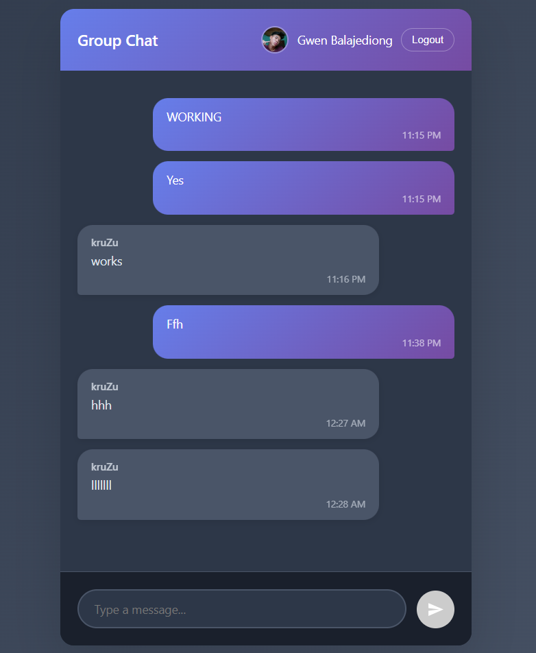

# Firebase Global Chat App



## Overview
This is a global chat application built with Firebase, allowing users to communicate in real-time. The project is a web app and includes a downloadable APK for Android users.

## Features
- Real-time global chat
- Progressive Web App (PWA) support
- Firebase backend integration
- Responsive design

## Getting Started
1. Clone the repository:
   ```sh
   git clone https://github.com/gwenz2/firebase-global-chat-vibecode.git
   ```
2. Open `index.html` in your browser to use the web app.
3. For Android, install `ChatApp.apk`.

## Project Structure
- `index.html` - Main HTML file
- `script.js` - JavaScript logic
- `styles.css` - Styling
- `manifest.json` - PWA manifest
- `icon-192.png`, `icon-512.png` - App icons
- `ChatApp.apk` - Android app

## License
See `LICENSE` for details.
